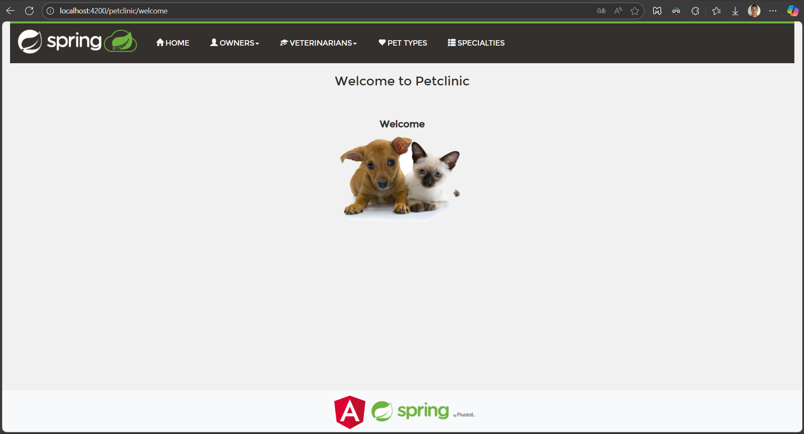
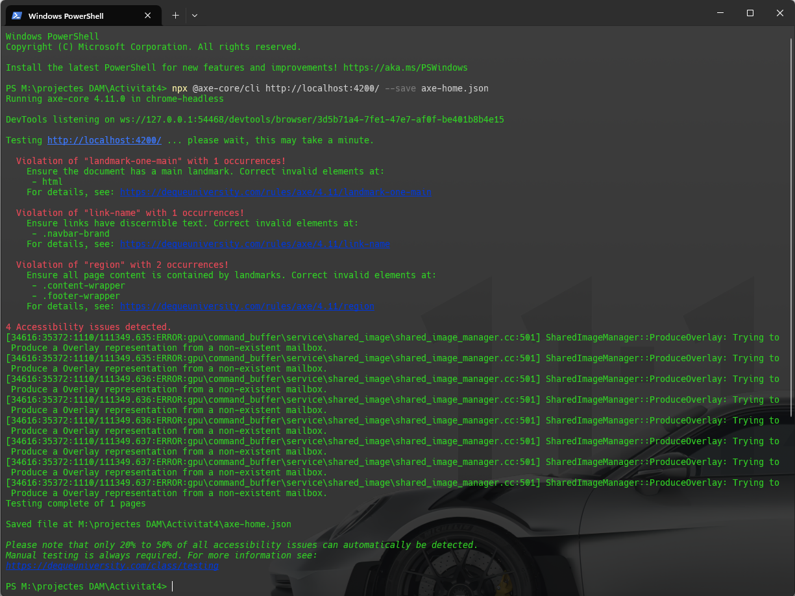
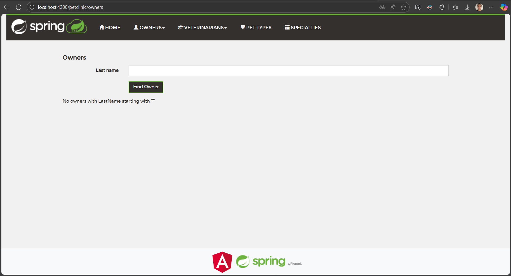
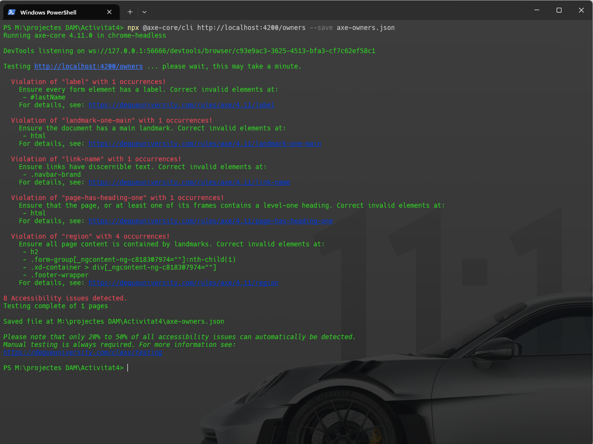
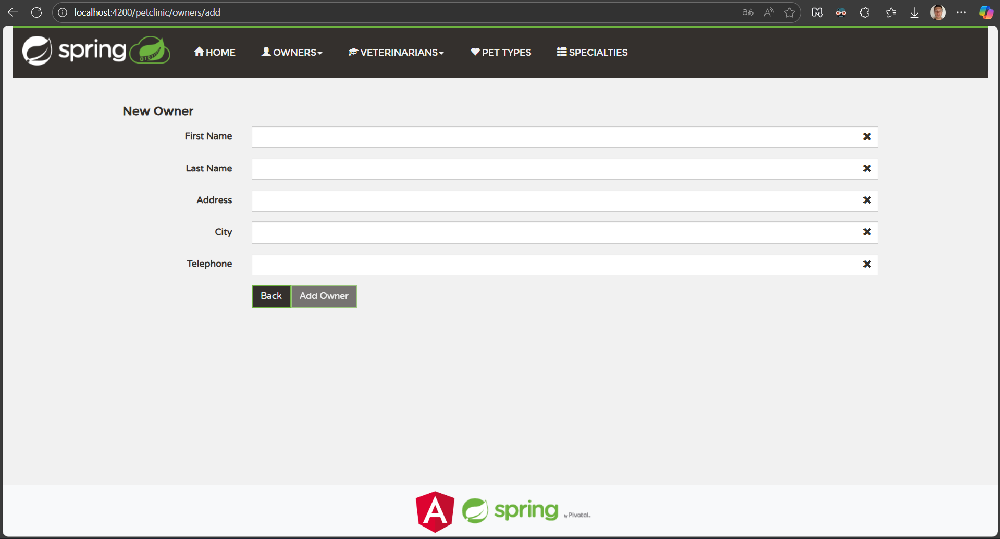
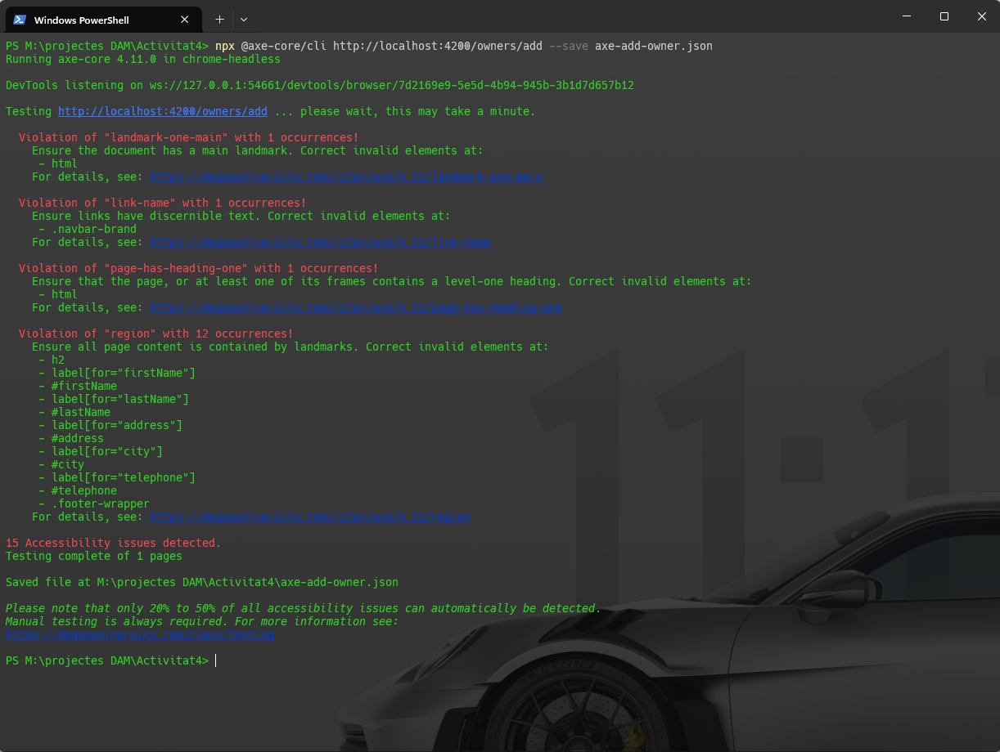

## Resum executiu

Aquest informe consolida els resultats de tres escaneigs amb axe-core (versió 4.11) per a les pàgines representants de l'aplicació Angular Spring PetClinic: Home (`/petclinic/`), Owners (`/petclinic/owners`) i Add Owner (`/petclinic/owners/add`). Metodologia: lectura i normalització dels tres JSON d'axe i agrupació de les violacions per tipus per prioritzar i proposar correccions tècniques orientades a Angular. Conclusions principals: hi ha problemes semàntics d'estructura (falta de `<main>` i absència d'un `h1` a múltiples pàgines), enllaços focusables sense nom accessible (p. ex. `.navbar-brand`) i incidències en l'etiquetatge de formularis que afecten la usabilitat amb lectors de pantalla. Recomanació urgent: corregir l'estructura de landmarks, assegurar un `h1` per pàgina, i donar noms accessibles als enllaços i labels als controls de formulari.

### Taula resum de compliment WCAG 2.1 AA

| Criteri WCAG | Nivell | Estat inicial | Estat objectiu | Prioritat |
|--------------|--------|---------------|----------------|-----------|
| 1.3.1 Info and Relationships | A | ❌ Falla | ✅ Compleix | Alta |
| 2.4.1 Bypass Blocks | A | ❌ Falla | ✅ Compleix | Alta |
| 2.4.4 Link Purpose (in context) | AA | ❌ Falla | ✅ Compleix | Alta |
| 2.4.6 Headings and Labels | AA | ❌ Falla | ✅ Compleix | Alta |
| 3.3.2 Labels or Instructions | A | ⚠️ Parcial | ✅ Compleix | Alta |
| 4.1.2 Name, Role, Value | A | ❌ Falla | ✅ Compleix | Alta |
| 1.4.3 Contrast (Minimum) | AA | ✅ Compleix | ✅ Compleix | Baixa |
| 1.1.1 Non-text Content | A | ✅ Compleix | ✅ Compleix | Baixa |

---

## 1. Resum de problemes agrupats per tipus

1) Landmarks i estructura de la pàgina
- Regles afectades: `landmark-one-main`, `region`.
- Problema: el layout no conté un `<main>` clar i part del contingut (p. ex. `.content-wrapper`, `.footer-wrapper`) queda fora de landmarks.
- Prioritat: Alta
- Impacte: dificulta la navegació per lectors de pantalla i l'accés ràpid al contingut principal.

2) Capçaleres (Headings)
- Regla: `page-has-heading-one` (absència d'`h1`).
- Prioritat: Alta
- Impacte: empitjora la comprensió del document i la navegació per capçaleres (lectors de pantalla).

3) Enllaços sense nom accessible
- Regla: `link-name` (ex.: `.navbar-brand` focusable sense text ni `aria-label`).
- Prioritat: Alta
- Impacte: usuaris de lector de pantalla reben un element amb rol/link sense propòsit.

4) Etiquetatge de formularis (labels)
- Regla: `label` (inputs detectats amb problemes o falta d'associació correcta en alguna vista).
- Prioritat: Alta
- Impacte: formularis inintel·ligibles per a tecnologies d'assistència i validació automatitzada.

5) Contrast i alternatives d'imatge
- Regla: `color-contrast` i `image-alt` majoritàriament PASS en els nodes revisats.
- Prioritat: Baixa (monitoratge continu).

6) ARIA / ordre de capçaleres
- En general `aria-*` validacions passen; `heading-order` OK en les pàgines revisades.
- Prioritat: Mitjana/baixa segons el cas.

---

## 2. Correccions tècniques concretes (per cada problema)

A continuació es donen solucions ràpides, cites WCAG i exemples Angular/HTML. Adapteu els fragments als vostres templates (`app.component.html`, `owners` components, etc.).

### A) Landmarks: afegir `<main>` al layout
- WCAG: 1.3.1 Info and Relationships (A); 2.4.1 Bypass Blocks (A).
- Acció: envolver el `router-outlet` en un `<main id="main" role="main">` al component de layout principal.
- Exemple (app.component.html):

```html
<nav class="navbar navbar-default" role="navigation">
	<!-- navbar content -->
</nav>

<a class="skip-link sr-only sr-only-focusable" href="#main">Skip to content</a>

<main id="main" role="main" class="main-wrapper">
	<router-outlet></router-outlet>
</main>

<footer role="contentinfo">...footer...</footer>
```

> Per què: els lectors de pantalla i usuaris de teclat poden saltar directament a la regió principal; axe deixarà de reportar `landmark-one-main` i `region` si tot el contingut està dins landmarks.

### B) Capçaleres: garantir un `h1` per pàgina
- WCAG: 2.4.6 Headings and Labels (AA); 1.3.1.
- Acció: afegir un `h1` visible (o accessible but visually-hidden si el disseny ho exigeix) a cada vista.
- Exemple (`owners-list.component.html`):

```html
<h1 class="page-title">Owners</h1>
<!-- contingut de la pàgina -->
```

```css
.sr-only { position: absolute; width: 1px; height: 1px; padding: 0; margin: -1px; overflow: hidden; clip: rect(0,0,0,0); border: 0; }
```

### C) Enllaços sense nom accessible (navbar brand)
- WCAG: 2.4.4 Link Purpose (AA); 4.1.2 Name, Role, Value (A).
- Acció: donar text visible o `aria-label` significatiu.
- Exemple (logo amb alt):

```html
<a class="navbar-brand" routerLink="/welcome" aria-label="PetClinic - Home">
	
</a>
```

> Preferible: text visible quan sigui coherent amb el disseny; `aria-label` com a alternativa quan només hi hagi logo.

### D) Formularis: assegurar `label for` i `id` coincidents
- WCAG: 3.3.2 Labels or Instructions (A); 4.1.2.
- Acció: cada `<input>` ha de tenir un `<label for="id">` o usar `aria-labelledby` apuntant a un element amb text.
- Exemple:

```html
<div class="form-group">
	<label for="lastName" class="col-sm-2 control-label">Last Name</label>
	<div class="col-sm-10">
		<input id="lastName" formControlName="lastName" type="text" class="form-control" />
	</div>
</div>
```

> Si useu Reactive Forms d'Angular, manteniu `id` i `formControlName` per garantir associació i tests automàtics.

### E) Skip link (bypass navigation)
- WCAG: 2.4.1.
- Acció: afegir un link al començament que sigui visible quan rep focus:

```html
<a class="skip-link sr-only sr-only-focusable" href="#main">Skip to content</a>
```

### F) Proves automàtiques (CI)
- Afegiu un test mínim amb `cypress + cypress-axe` o un script Puppeteer+axe-core que obri les 3 rutes i falli si existeixen violacions crítiques: `landmark-one-main`, `page-has-heading-one`, `link-name`, `label`.

---

## 3. Pla de millores prioritzat i criteris d'acceptació

Prioritat Alta (Sprint 1)
- Afegir `<main role="main">` al layout (Owner: frontend)
	- Criteri d'acceptació: axe (rutes auditades) → 0 violations per `landmark-one-main`; comprovació manual amb NVDA o VoiceOver que el salt al main funciona.
- Afegir/garantir `h1` per pàgina (Owners, Add Owner, Home)
	- Criteri: axe → `page-has-heading-one` = 0; test unitari que comprovi `document.querySelector('h1') !== null` en cada vista.
- Donar noms accessibles a enllaços focusables (ex.: `.navbar-brand`)
	- Criteri: axe → `link-name` per aquests selectors = 0.
- Revisar i corregir labels de formularis (ex.: `#lastName` si falta)
	- Criteri: axe → `label` violations sobre inputs auditats = 0.

Prioritat Mitjana (Sprint 2)
- Implementar Skip link i millorar l'estat de focus visible (`:focus-visible`).
- Fer proves de teclat/manual i corregir nested-interactive o focus traps.

Prioritat Baixa (refactor)
- Millorar missatges d'error ARIA (`aria-errormessage` o `aria-describedby`) i estils visuals d'accés (contrasts, outlines).

---

## 4. Proves i verificació

Automàtic
- Afegir un job en CI que executi un script que carrega `/petclinic/`, `/petclinic/owners`, `/petclinic/owners/add` i executi axe-core; el pipeline ha de fallar si existeixen violacions en les regles d'alta prioritat esmentades.

Manual
- Validar amb NVDA o VoiceOver: navegar per tabulacions, validar that Skip link works, que `h1` existeix i els enllaços són anunciats amb propòsit.

---

## 5. Properes passes i opcions d'execució

Puc fer una d'aquestes opcions segons preferiu:

- Opció A — aplicar els canvis mínims directament al repo (editar `app.component.html`, i els templates `owners` i `owner-add`) i executar una passada local d'axe per verificar la reducció de violacions. (Necessitaré el projecte obert al workspace per editar i executar proves.)
- Opció B — generar un patch/PR proposat amb els canvis i exemples de tests automàtics perquè l'equip l'incorpori.
- Opció C — només lliurar el document `.md` amb les instruccions i fragments (fet; ja el tens) i deixar l'execució a l'equip.

Indica quin flux prefereixes i procediré: aplicar canvis + testejar (A), crear patch/PR (B) o aturar-me aquí amb instruccions (C).

---

## Annex: Mapatge ràpid regla → WCAG → acció

- `landmark-one-main` → 1.3.1 / 2.4.1 → Afegir `<main role="main">`.
- `page-has-heading-one` → 2.4.6 / 1.3.1 → Afegir `h1` per pàgina.
- `link-name` → 2.4.4 / 4.1.2 → Afegir text visible o `aria-label` als enllaços focusables.
- `label` → 3.3.2 / 4.1.2 → Assegurar `label for` coincideixi amb `id` dels inputs.

---

### Comprovació final
Després d'aplicar aquests canvis, recomano executar una passada d'axe completa (automàtica) i una revissió manual ràpida amb un lector de pantalla per confirmar l'experiència d'usuari.

Aquest fitxer ja està preparat com a `Resum executiu.md` al directori del projecte.

---

## 6. Resultats per pàgina

Per facilitar la lectura del professorat/a o l'equip QA, a continuació es presenten taules resum per cada pàgina auditable (tipus de problema, impacte, WCAG referència i fragment de codi suggerit).

### 6.1 Home — `/petclinic/`

| Tipus de problema | Impacte | WCAG (nivell) | Fragment de codi / Fix suggerit |
|---|---:|---|---|
| Falta `<main>` (landmark-one-main) | Alt | 1.3.1 / 2.4.1 (A) | Afegir al layout: `<main id="main" role="main"> <router-outlet></router-outlet> </main>` |
| Enllaç `.navbar-brand` sense nom accessible (link-name) | Alt | 2.4.4 (AA) / 4.1.2 (A) | `<a class="navbar-brand" routerLink="/welcome" aria-label="PetClinic - Home"></a>` |
| Contingut fora landmarks (region) | Mitjà | 2.4.1 (A) | Garantir que `.content-wrapper` estigui dins `<main>` |

### 6.2 Owners — `/petclinic/owners`

| Tipus de problema | Impacte | WCAG (nivell) | Fragment de codi / Fix suggerit |
|---|---:|---|---|
| Input sense label o amb associació errònia (`#lastName`) (label) | Alt | 3.3.2 (A) / 4.1.2 (A) | `<label for="lastName">Last Name</label><input id="lastName" ...>` |
| Falta `h1` (page-has-heading-one) | Alt | 2.4.6 (AA) | Afegir `<h1 class="page-title">Owners</h1>` a la vista |
| Navbar brand sense text (link-name) | Alt | 2.4.4 (AA) | Veure fix a Home |

### 6.3 Add Owner — `/petclinic/owners/add`

| Tipus de problema | Impacte | WCAG (nivell) | Fragment de codi / Fix suggerit |
|---|---:|---|---|
| Landmarks i regió (landmark-one-main / region) | Alt | 1.3.1 / 2.4.1 (A) | Envoltar el formulari dins `<main>` i assegurar `role="main"` |
| Formulari: labels i `for` (label, form-field-multiple-labels) | Alt | 3.3.2 (A) | Revisar tots els `input` (`firstName`, `lastName`, `address`, `city`, `telephone`) — usar `<label for>` i `id` corresponent |
| Skip link absent | Mitjà | 2.4.1 (A) | Afegir `<a class="skip-link" href="#main">Skip to content</a>` visible al focus |

---

## 7. Anàlisi IA consolidada

7.1 Agrupació de problemes (resum)
- Estructura semàntica i landmarks: manca d'un `<main>` comú i elements (ex.: `.content-wrapper`) reportats per `region`.
- Estructura de capçaleres: pàgines amb absència d'`h1` (`page-has-heading-one`).
- Només accessibles: enllaços focusables sense nom (p.ex. `.navbar-brand`) que trenquen 4.1.2 i 2.4.4.
- Formularis: inputs amb etiquetatge incomplet o mal associat (especialment `#lastName` a Owners), afectant 3.3.2.
- Color i alt: majoritàriament correctes en aquests scans però es recomana mantenir proves automàtiques.

7.2 Priorització i justificació
- Prioritat Alta: tot allò que impedeix que un lector de pantalla entengui la finalitat d’un control o la regió principal (labels, link-name, landmark-one-main, page-has-heading-one). Risc alt per usuaris amb discapacitat visual.
- Prioritat Mitjana: skip links, focus styles, nested-interactive si apareix.
- Prioritat Baixa: refinaments visuals (contrasts ja passats) i neteja d'atributs ARIA no utilitzats.

7.3 Propostes de correcció (resum tècnic)
- Correcció global layout: editar `app.component.html` (o layout compartit) per incloure `skip link`, `<main role="main">` i `footer role="contentinfo"`.
- Correcció formularis: revisar templates `owner-add` i `owners` per garantir `<label for>` i `id` coincidents i utilitzar `aria-describedby` per missatges d'error.
- Correcció enllaços: proporcionar text visible o `aria-label` per logos i enllaços icònics.
- Tests: afegir script automatitzat (cypress-axe o Puppeteer+axe) per detectar regressions a CI.

---

## 8. Pla de millores (accions immediates i estructurals)

8.1 Accions immediates (Sprint 1 — 1 a 2 dies)
- A1: Afegir `<main id="main" role="main">` al layout i moure `router-outlet` dins d'aquest main.
	- Responsable: Frontend
	- Mesurable: axe ⇒ 0 violacions per `landmark-one-main` a les 3 rutes.
- A2: Afegir `h1` a cada vista (Owners, Add Owner, Home).
	- Mesurable: axe ⇒ `page-has-heading-one` = 0; test script comprova `document.querySelector('h1')`.
- A3: Fixar `.navbar-brand` per tenir `aria-label` o text visible.
	- Mesurable: axe ⇒ `link-name` violacions per `.navbar-brand` desapareixen.
- A4: Revisar i corregir labels en formularis (inputs identificats: `firstName`, `lastName`, `address`, `city`, `telephone`).
	- Mesurable: axe ⇒ `label` violations 0 per inputs auditats.

8.2 Accions estructurals (Sprint 2 — 1 a 2 setmanes)
- B1: Implementar Skip link i estils `:focus-visible` per millorar experiència teclat.
- B2: Integrar proves cypress-axe al pipeline i configurar regles crítiques per fallada automàtica.
- B3: Revisió d'errors ARIA i implementació d'`aria-errormessage`/`aria-describedby` en formularis per l'experiència de validació.

8.3 Acceptació i proves
- Acceptació tècnica: generar report d'axe per CI amb thresholds (0 violations per llista prioritzada). Afegir un checklist manual amb passos NVDA/VoiceOver.

8.4 Cronograma estimat

| Sprint | Durada | Tasques | Entregable |
|--------|--------|---------|------------|
| Sprint 1 | 3 dies | A1-A4 (correccions crítiques) | Layout + formularis corregits, report axe amb 0 violations crítiques |
| Sprint 2 | 1 setmana | B1-B3 (proves CI, skip links) | Pipeline amb axe integrat, documentació actualitzada |

---

## 9. Annexos

9.1 Fitxers adjunts (auditoria)

### Home ([axe-home.json](axe-home.json))

#### Captura pàgina


#### Comande execució Axe-Core


#### Extracte de violacions crítiques

```json
{
  "id": "landmark-one-main",
  "impact": "moderate",
  "tags": ["cat.semantics", "best-practice"],
  "description": "Ensures the document has a main landmark",
  "help": "Document should have one main landmark",
  "helpUrl": "https://dequeuniversity.com/rules/axe/4.11/landmark-one-main",
  "nodes": [
    {
      "html": "<html lang=\"en\">",
      "target": ["html"],
      "failureSummary": "Fix any of the following:\n  Page does not have a main landmark"
    }
  ]
}
```

<br>

### Owners ([axe-owners.json](axe-owners.json))

#### Captura pàgina


#### Comande execució Axe-Core


#### Extracte de violacions crítiques

```json
{
  "id": "label",
  "impact": "critical",
  "tags": ["cat.forms", "wcag2a", "wcag332", "wcag131", "section508"],
  "description": "Ensures every form element has a label",
  "help": "Form elements must have labels",
  "nodes": [
    {
      "html": "<input id=\"lastName\" type=\"text\" class=\"form-control\">",
      "target": ["#lastName"],
      "failureSummary": "Fix any of the following:\n  Form element does not have an implicit (wrapped) <label>\n  Form element does not have an explicit <label>\n  aria-label attribute does not exist or is empty"
    }
  ]
}
```

<br>

### Add owner ([axe-add-owner.json](axe-add-owner.json))


#### Comande execució Axe-Core


#### Extracte de violacions crítiques

```json
{
  "id": "page-has-heading-one",
  "impact": "moderate",
  "tags": ["cat.semantics", "best-practice"],
  "description": "Ensure that the page has only one h1",
  "help": "Page should contain a level-one heading",
  "nodes": [
    {
      "html": "<html lang=\"en\">",
      "target": ["html"],
      "failureSummary": "Fix all of the following:\n  Page must have a level-one heading"
    }
  ]
}
```

<br>

9.2 Prompt utilitzat per a generar la síntes  les recomenacions
Context:
Ets un expert en accessibilitat web (WCAG 2.1 AA) i qualitat de software. Has realitzat una auditoria automàtica amb axe-core sobre tres pàgines representatives d'una aplicació Angular (Spring PetClinic). Les pàgines auditades són:

Pàgina d'Inici (/)

Llista de Propietaris (/owners)

Formulari "Afegir Propietari" (/owners/add)

Has obtingut tres fitxers JSON amb els resultats de axe-core per a cada pàgina. Ara, necessites una anàlisi detallada d'aquests resultats per elaborar un informe tècnic definitiu.

Les teves tasques són les següents:

Anàlisi i Consolidació: Analitza els fitxers JSON que proporcionaré a continuació. Agrupa tots els problemes detectats (violacions, incompliments) per tipus de problema en lloc de per pàgina. Per exemple: "Problemes de contrast de color", "Falta d'atributs alt en imatges", "Elements de formulari sense etiquetes associades", etc.

Priorització i Impacte: Per a cada tipus de problema identificat, classifica'l segons la seva prioritat (Alta, Mitjana, Baixa) i el seu impacte en els usuaris amb diversitat funcional (per exemple: "Impacte alt per a usuaris amb discapacitat visual", "Impacte mitjà per a usuaris que utilitzen teclat").

Correccions Tècniques: Per a cada problema, proporciona una recomanació de correcció clara i accionable. Aquesta ha d'incloure:

El criteri WCAG 2.1 AA específic que no es compleix.

Una descripció tècnica del perquè és un problema.

Un fragment de codi d'exemple que il·lustri com es podria solucionar el problema en el context d'una aplicació Angular (utilitzant HTML semàntic, ARIA, etc.).

Explica per què aquesta correcció millora l'accessibilitat.

Pla de Millores Estructurat: Amb tota la informació anterior, genera un pla de millores que es pugui incorporar directament a l'informe final. Aquest pla s'ha d'estructurar en:

Accions Immediates (Prioritat Alta): Correccions ràpides i crítiques que s'han de resoldre de forma urgent.

Accions Estructurals (Prioritat Mitjana-Baixa): Millores que podrien requerir una mica més de planificació o canvis en components reutilitzables.

Els elements d'aquest pla han de ser mesurables (per exemple: "Assegurar que tots els botons tenen un text accessible o un atribut aria-label", "Garantir un ratio de contrast mínim de 4.5:1 per a tot el text").

Resumen Executiu: Finalment, redacta un resumen executiu d'unes 150 paraules que resumeixi els punts següents per a l'informe:

Objectiu de l'auditoria.

Metodologia utilitzada (eines, mostreig de pàgines).

Visió general dels resultats (quantificació dels problemes trobats, àrees més crítiques).

Recomanació principal.

Dades per analitzar (documents .json adjuntats: ([axe-home.json](axe-home.json)), ([axe-owners.json](axe-owners.json)) i ([axe-add-owner.json](axe-add-owner.json)))

<br>

9.3 Proves manuals

#### Proves manuals realitzades
- Navegació amb teclat (Tab, Shift+Tab, Enter) per totes les pàgines
- Validació amb lector de pantalla NVDA/VoiceOver per verificar anuncis correctes
- Comprovació de focus visible en tots els elements interactius
- Test de bypass amb Skip link funcional

9.4 Glossari WCAG (principals referències citades)
- 1.3.1 Info and Relationships (A): la semàntica i relacions (capçaleres, landmarks, labels) han de ser preservades per facilitar la comprensió.
- 2.4.1 Bypass Blocks (A): proveir mecanismes per saltar contingut repetitiu (skip links o landmarks).
- 2.4.4 Link Purpose (in context) (AA): els enllaços han de tenir un propòsit discernible en context.
- 2.4.6 Headings and Labels (AA): capçaleres i etiquetes han de reflectir la seva funció i ajudar la navegació.
- 3.3.2 Labels or Instructions (A): etiquetes i instruccions clares per controls de formulari.
- 1.4.3 Contrast (AA): contrast de text suficient per usuaris amb baixa visió.
- 1.1.1 Non-text Content (A): imatges i elements no-text han de tenir alternatives textuals.
- 4.1.2 Name, Role, Value (A): les tecnologies assistives han d'obtenir nom, rol i valor dels controls.
